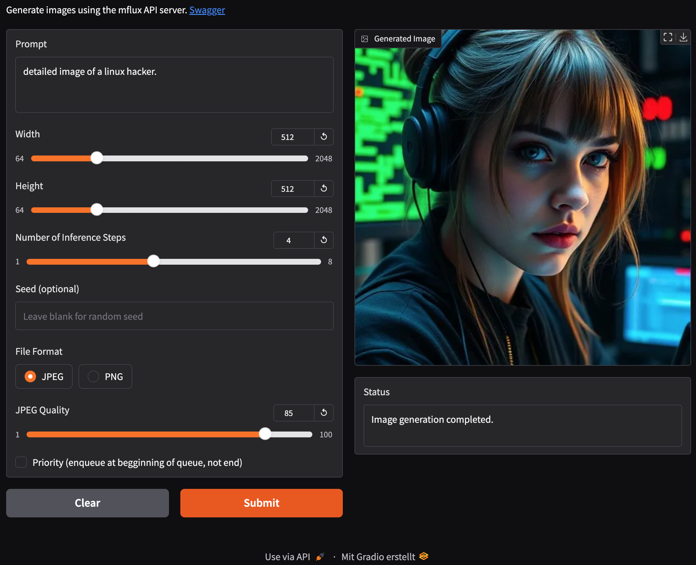

# API Server for mflux

This API server is designed for asynchronous image generation tasks with [mflux](https://github.com/filipstrand/mflux). It is particularly optimized for environments where GPU resources need to be shared across multiple tasks, such as in generative AI chat programs. This server ensures that only one image generation task runs at a time to efficiently use GPU resources. We also add a default user interface to provide a multi-image generation front-end.

## Examples

Here are two different client applications that use the server API. The first one is the default web-frontend which is available at `http://localhost:4030`


The second screenshot shows the Gradio Front-End:



Code for both client applications is located in the `clients` subdirectory.

## Features

The API supports features such as:
- Queuing of image generation tasks.
- Forecasting computation time for better user experience in multi-user environments.
- Managing task statuses and retrieving generated images.

Furthermore, the API exposes a swagger endpoint to self-document the server.

## Example usage

You need a huggingface access token to get the weights from the gated huggingface repository.
Create a token and then install the huggingface CLI with `pip install huggingface-hub`,
then log in with `huggingface-cli login` and paste in your access token.

The server can be installed and started with i.e.
```
python3 -m venv .venv
source .venv/bin/activate
pip3 install -r requirements.txt
python3 server.py --quantize 8 --host 0.0.0.0
```

As a convenience script, you can instead just run `run.sh` which does all of that automatically.

The server then runs on port 4030 by default. Host and port can be configured by call parameters, try `server.py --help`.
To see the swagger documentation, open `http://localhost:4030/swagger`

To produce an image, the usual workflow is:
- `/api/generate` to initialize the generation, this returns a `task_id`
- `/api/status` to check if the image generation has finished. If not, this also returns an approximated waiting time which can be used in a front-end to show a progress bar
- `/api/image` to retrieve the produced image as soon as the status turns to "done"

In detail - here is a call to generate an image:

```
curl -X 'POST' \
  'http://localhost:4030/api/generate' \
  -H 'accept: application/json' \
  -H 'Content-Type: application/json' \
  -d '{
  "prompt": "A beautiful landscape",
  "seed": "1725311496",
  "height": 1024,
  "width": 1024,
  "steps": 4,
  "format": "JPEG",
  "quality": 85,
  "priority": false
}'
```

The response is then an object i.e. with:

```
{
  "task_id": "1fc9cc4f",
  "task_length": 1,
  "expected_time_seconds": 146.88675427253082
}
````

The `task_id` can then be used to check the image generation status:

```
curl -X 'GET' \
  'http://localhost:4030/api/status?task_id=1fc9cc4f' \
  -H 'accept: application/json'
```

a response would be i.e.:
```
{
  "pos": 0,
  "status": "waiting",
  "wait_remaining": 15
}
```
... which means that the image is not ready and is expected to be ready in 15 second. The position is 0 which means that no other image is in queue before.

Finally, the image can be retrieved with:

```
curl -X 'GET' \
  'http://localhost:4030/api/image?task_id=1fc9cc4f' \
  -H 'accept: application/json'
```

This returns the jpeg binary and removes the image from the production queue.

There are more API endpoints to list the queue and delete entries from the queue, see swagger documentation for details.

## python client (quick example)

Here are three functions which implement a client endpoint for the image generation process as shown above with curl:

```
def mflux_generate_client(mfluxendpoint, prompt, width=1280, height=720, steps=4, seed=None, format="JPEG", quality=85, priority=False):
    data = {
        "prompt": prompt,
        "height": height,
        "width": width,
        "steps": steps,
        "format": format,
        "quality": quality,
        "priority": priority
    }
    if seed is not None:
        data["seed"] = seed
    response = requests.post(mfluxendpoint + "/api/generate", json=data)
    # parse the response and get the task_id
    json = response.json()
    task_id = json["task_id"]
    return task_id
    
def mflux_status_ready(mfluxendpoint, task_id):
    response = requests.get(mfluxendpoint + "/api/status?task_id=" + task_id)
    if response.status_code == 200:
        status = response.json()["status"]
        if status == "done":
            return 0
        else:
            # read the waiting time
            waiting_time = response.json().get("wait_remaining", 1)
            if waiting_time < 1: waiting_time = 1
            return waiting_time
    else:
        return -1

def mflux_get_image(mfluxendpoint, task_id):
    response = requests.get(mfluxendpoint + "/api/image?task_id=" + task_id + "&base64=false&delete=true")
    if response.status_code == 200:
        return response.content
    else:
        return None
```

The mfluxendpoint would be a string like `http://localhost:4030`. 
A single function which uses the client endpoints above to get an image can be i.e.:

```
def generate_image(mfluxendpoint, prompt, width=1280, height=720, steps=4):
    startt = time.time()
    task_id = mflux_generate_client(mfluxendpoint, prompt, width=width, height=height, steps=steps)
    for i in range(10000):
        waiting_time = mflux_status_ready(mfluxendpoint, task_id)
        print("Waiting time: ", waiting_time, " seconds")
        if waiting_time == 0: break
        nextsleep = max(min(waiting_time / 4, 10), 1)
        time.sleep(nextsleep)
    imageb = mflux_get_image(mfluxendpoint, task_id)    
    stopt = time.time()
    print("Time taken: ", stopt - startt, " seconds")
    image = Image.open(BytesIO(imageb))
    return image
```

## License

The code is licensed under the Apache 2.0 license.

## Contribution and Contact

Pull requests to enhance the code are welcome!

If you want to share your experience with mflux-server on social media, please notify me under one of the following addresses:

- Mastodon: `@orbiterlab@sigmoid.social`
- X: `@orbiterlab`
