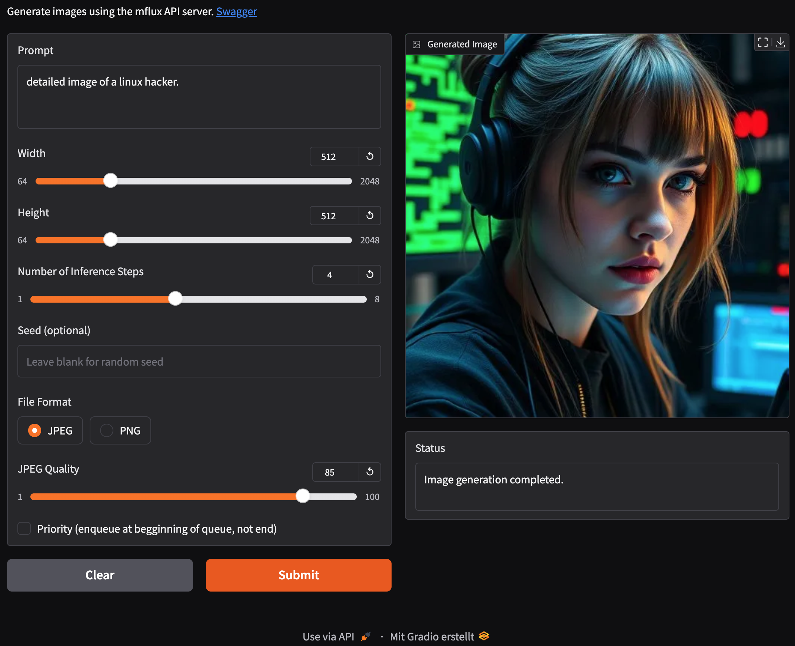

# API Server for mflux

This API server is designed for asynchronous image generation tasks with [mflux](https://github.com/filipstrand/mflux). It is particularly optimized for environments where GPU resources need to be shared across multiple tasks, such as in generative AI chat programs. This server ensures that only one image generation task runs at a time to efficiently use GPU resources. We also add a default user interface to provide a multi-image generation front-end.

## Supported models at a glance

**Default: FLUX.2 Klein 4B — ungated, 4 inference steps.** Start it with
`./run.sh`, or choose any model below with `./run.sh --model NAME`.
The startup parameter also works with `.venv/bin/python3.12 server.py`.
This table covers every checkpoint registered by this server; additional
accepted names for the same checkpoints are listed just below it.

| Model / checkpoint | Startup parameter | Parameters¹ | Gated² | Default steps³ | Fast, few-step model⁴ |
| --- | --- | ---: | :---: | ---: | :---: |
| **[FLUX.2 Klein 4B](https://huggingface.co/black-forest-labs/FLUX.2-klein-4B) (default)** | `--model flux2-klein-4b` | 4B | No | **4** | **Yes** |
| [FLUX.2 Klein 9B](https://huggingface.co/black-forest-labs/FLUX.2-klein-9B) | `--model flux2-klein-9b` | 9B | Yes | **4** | **Yes** |
| [FLUX.1 Schnell](https://huggingface.co/black-forest-labs/FLUX.1-schnell) | `--model schnell` | 12B | Yes | **4** | **Yes** |
| [FLUX.1 Schnell, 4-bit](https://huggingface.co/dhairyashil/FLUX.1-schnell-mflux-v0.6.2-4bit) | `--model dhairyashil/FLUX.1-schnell-mflux-v0.6.2-4bit` | 12B | No | **4** | **Yes** |
| [Krea 2 Turbo](https://huggingface.co/krea/Krea-2-Turbo) | `--model krea2` | ~12B | Yes | **8** | **Yes** |
| [ERNIE-Image Turbo](https://huggingface.co/baidu/ERNIE-Image-Turbo) | `--model ernie-image-turbo` | 8B | No | **8** | **Yes** |
| [Z-Image Turbo](https://huggingface.co/Tongyi-MAI/Z-Image-Turbo) | `--model z-image-turbo` | 6B | No | **9** | **Yes** |
| [Z-Image Turbo, 4-bit](https://huggingface.co/filipstrand/Z-Image-Turbo-mflux-4bit) | `--model filipstrand/Z-Image-Turbo-mflux-4bit` | 6B | No | **9** | **Yes** |
| [Ideogram 4 FP8](https://huggingface.co/ideogram-ai/ideogram-4-fp8) | `--model ideogram4` | 9.3B per transformer¹ | Yes | 20 (preset) | No |
| [FLUX.1 Dev](https://huggingface.co/black-forest-labs/FLUX.1-dev) | `--model dev` | 12B | Yes | 25 | No |
| [FLUX.1 Dev, 4-bit](https://huggingface.co/dhairyashil/FLUX.1-dev-mflux-4bit) | `--model dhairyashil/FLUX.1-dev-mflux-4bit` | 12B | No | 25 | No |
| [FLUX.1 Krea Dev](https://huggingface.co/black-forest-labs/FLUX.1-Krea-dev) | `--model krea-dev` | 12B | Yes | 25 | No |
| [FLUX.1 Krea Dev, 4-bit](https://huggingface.co/filipstrand/FLUX.1-Krea-dev-mflux-4bit) | `--model filipstrand/FLUX.1-Krea-dev-mflux-4bit` | 12B | No | 25 | No |
| [Qwen-Image-2512](https://huggingface.co/Qwen/Qwen-Image-2512) | `--model qwen` | 20B | No | 25 | No |
| [Qwen-Image, 6-bit](https://huggingface.co/filipstrand/Qwen-Image-mflux-6bit) | `--model filipstrand/Qwen-Image-mflux-6bit` | 20B | No | 25 | No |
| [FIBO](https://huggingface.co/briaai/FIBO) | `--model fibo` | 8B | Yes | 25 | No |
| [FIBO, 4-bit](https://huggingface.co/briaai/Fibo-mlx-4bit) | `--model briaai/Fibo-mlx-4bit` | 8B | No | 25 | No |
| [FIBO, 8-bit](https://huggingface.co/briaai/Fibo-mlx-8bit) | `--model briaai/Fibo-mlx-8bit` | 8B | No | 25 | No |
| [Qwen-Image 2.1](https://huggingface.co/Qwen/Qwen-Image-2.1) | `--model qwen-image-2.1` | 7B | No | 40 | No |
| [ERNIE-Image](https://huggingface.co/baidu/ERNIE-Image) | `--model ernie-image` | 8B | No | 50 | No |

¹ **Parameters** are the published, rounded image-generation transformer sizes
(B = billion), excluding text/vision encoders and the VAE. They are not total
pipeline sizes or RAM requirements. Ideogram 4 uses separate positive and
negative transformer branches. Quantization reduces weight storage, not the
underlying parameter count.

² **Gated** describes the linked checkpoint repository, checked anonymously
against Hugging Face metadata and weight-file access on **22 September 2026**.
“Yes” requires access to that repository and authentication with `hf auth login`
or `HF_TOKEN`; “No” means the repository allows anonymous downloads. In
particular, the official FLUX.1 Schnell repository is gated even though its
listed 4-bit conversion is not. Access status can change and is separate from
the model's license, which is linked on its model page.

³ **Default steps** come from this server's registry, not a generic upstream
example. Override them per generation using the API's `steps` field or the
client's steps control. Ideogram 4 instead uses `preset`, defaulting to
`V4_DEFAULT_20`; its `steps` field does not override the preset.
With mflux 0.20.0, `qwen` selects Qwen-Image-2512, while the separately listed
6-bit repository contains the earlier Qwen-Image checkpoint.

⁴ **Fast, few-step model** means a model designed to generate in the listed
4–9 steps. This indicates a low-step speed advantage, not a measured ranking
across models. Actual latency also depends on model size, resolution, reference
images, guidance and hardware. The 20–50-step entries are not few-step models,
even when they benefit from caching. Quantization does not guarantee a speedup;
see the measured [FLUX.2 performance](docs/flux2-performance.md) and
[Qwen 2.1 quantization results](docs/qwen21-quantization-performance.md).

### Additional accepted model names

Use any name in the right column as the value of `--model` (or the API's
`model` field). These aliases have the same parameters, gating and defaults as
their corresponding row above. `/api/ls` returns the complete live registry.

| Model name above | Additional accepted names |
| --- | --- |
| `flux2-klein-4b` | `black-forest-labs/FLUX.2-klein-4B` |
| `flux2-klein-9b` | `black-forest-labs/FLUX.2-klein-9B` |
| `krea2` | `krea-2`, `krea-2-turbo`, `krea/Krea-2-Turbo` |
| `ernie-image-turbo` | `baidu/ERNIE-Image-Turbo` |
| `ernie-image` | `baidu/ERNIE-Image` |
| `qwen-image-2.1` | `qwen-2.1`, `qwen-image-21`, `Qwen/Qwen-Image-2.1` |
| `ideogram4` | `ideogram-4-fp8`, `ideogram-ai/ideogram-4-fp8` |

## Examples

Here are two different client applications that use the server API. The first one is the default web-frontend which is available at `http://localhost:4030`


The second screenshot shows the Gradio Front-End:



Code for both client applications is located in the `clients` subdirectory.

## Features

The API supports features such as:

- Queuing of image generation tasks.
- Immediate worker wakeup for queued generations and model loads, without the
  former one-second polling delay. GPU requests still run one at a time.
- Forecasting computation time for better user experience in multi-user environments.
- Managing task statuses and retrieving generated images.
- Reporting failed tasks without stopping the worker or retrying them automatically.

Furthermore, the API exposes a swagger endpoint to self-document the server.

## Example usage

Use Python 3.12. The server dependencies in `requirements.txt` pin
`mflux==0.20.0` and require `mlx>=0.32.2,<0.33.0` and
`protobuf>=4.25.0,<8.0`.

Install the dependencies in a virtual environment:

```sh
python3.12 -m venv .venv
source .venv/bin/activate
python3.12 -m pip install -r requirements.txt
```

For gated Hugging Face models, obtain access to the model repository and log in
with `hf auth login`, or set `HF_TOKEN`. The Hugging Face CLI is installed with
the server dependencies. Authentication is separate from starting the server.

```sh
python3.12 server.py --quantize 8 --host 0.0.0.0
```

The default model is `flux2-klein-4b`, with 4 inference steps and guidance
1.0. Select another model with `--model`; `/api/ls` lists supported model names
and defaults, and `/api/ps` reports the current settings. Without `--host`, the
server listens on `127.0.0.1`.

FLUX.2 Klein 4B's official weights can be downloaded without Hugging Face
authentication or access approval. Plain `./run.sh` uses this model with no
quantization; `--quantize 8` or `--quantize 4` remains optional.

Alternatively, `./run.sh --quantize 8` creates or reuses `.venv`, upgrades the
dependencies within the requirements constraints, and starts the server on
`0.0.0.0`. It requires Python 3.12 and does not perform Hugging Face login.

### Qwen Image 2.1

Qwen Image 2.1 uses the native `QwenImage21` implementation in the pinned
`mflux==0.20.0` dependency. For an existing installation, upgrade the virtual
environment with `.venv/bin/python3.12 -m pip install -r requirements.txt`
before starting the server.

```sh
./run.sh --model qwen-image-2.1 --quantize 8
# Or, after installing requirements:
.venv/bin/python3.12 server.py --model qwen-image-2.1 --quantize 8 --host 0.0.0.0
```

Aliases are `qwen-image-2.1`, `qwen-2.1`, `qwen-image-21`, and
`Qwen/Qwen-Image-2.1`. They work with `--model` and `POST /api/load`
(`{"model": "qwen-image-2.1", "quantize": 8}`), and appear in `/api/ls` and the
web frontend. Its inference steps slider reaches 50 and defaults to 40 for
Qwen Image 2.1. Defaults are **40 steps, guidance 1.0, 1024×1024**. Width and height
must be positive multiples of 16 and steps must be at least 2; invalid values
are rejected before queuing.

```sh
curl http://localhost:4030/api/generate -H 'Content-Type: application/json' \
  -d '{"prompt":"A small robot reading in a sunlit library","seed":"42","format":"PNG"}'
```

The server supports RGB text-to-image and instruction editing with **up to ten
ordered reference images** in `init_images`. The legacy base64 `init_image`
field also uses reference conditioning, starting from fresh noise (no fixed
img2img strength). Refer to attachments as “image 1”, “image 2”, etc. in your
prompt. Transparent output and LoRAs are not supported.

mflux 0.20.0 provides the native model components but not the reference-editing
pipeline. The server connects its Qwen3-VL vision tower and language encoder,
RGBA VAE inputs, and block-causal transformer attention for this path. Vision
weights are loaded lazily from the same Qwen checkpoint on the first edit and
remain resident with the model. No additional inference backend is required.
References preserve aspect ratio and share a pixel budget of at most 1024×1024
(or the output area when smaller), divided equally among attachments. They are
aligned to 32 pixels and are not enlarged except to meet that minimum. This
bounds reference processing and memory on Metal; many attachments reduce the
detail retained in each reference. Their order is preserved throughout.
For optional true classifier-free guidance, pass a nonempty `negative_prompt`
and `guidance` greater than 1; without both, it performs no negative pass.
`negative_prompt` is forwarded for Qwen Image 2.1 and Krea 2.

The server enables per-layer **context KV caching** for Qwen Image 2.1 by
default. The first denoising step records the invariant text keys and values;
later steps process only the changing image tokens. Native mflux still supplies
the model components, weights, quantization, scheduler and VAE decoding.
This does not skip denoising steps or approximate the cached context. Different
matrix shapes can produce normal floating-point differences, so identical seeds
are not guaranteed to give bit-identical output to the uncached implementation.

Positive and negative prompts have separate cache entries. For text-to-image,
the cache is limited to two entries and 512 MiB per request and is released after generation, including
failed requests. Padded inputs, unsupported batch sizes, and contexts exceeding
the limit use native execution. Compiled functions are reused across requests,
but prompt KV tensors are not. Reference editing caches both text and image
prefixes, with a separate 3 GiB total request limit shared by positive/negative
branches. Over-budget branches recompute their prefix each step; the same
`--no-qwen21-context-cache` switch disables reuse. Other models are unaffected. `/api/info` reports
`context_kv_cache`; it reports whether this optimization is enabled for the
selected model, not whether every input qualifies. Disable it for A/B comparison:

```sh
.venv/bin/python3.12 server.py --quantize 8 --no-qwen21-context-cache
```

The synchronized Metal benchmark at
[`benchmarks/benchmark_qwen21_context.py`](benchmarks/benchmark_qwen21_context.py)
compares native and cached denoising, includes cache prefill in timings, and
reports numerical error and peak allocated memory. It uses a small synthetic
model by default; pass `--model-path /path/to/cached/Qwen-Image-2.1/snapshot` to
load the real transformer locally. It never downloads weights. Inputs remain
synthetic, and its timings exclude text encoding and VAE decoding.
The companion `benchmarks/verify_qwen21_context.py` compares actual prompts and
decoded images. See [Metal measurements and reproduction steps](docs/qwen21-metal-performance.md)
for performance, numerical differences, memory costs and the MLX guidance used.

The initial download is approximately 33 GB even with `--quantize 4` or
`--quantize 8`. The text encoder stays bf16. MFLUX's Qwen Image 2.1 guide reports
about 46 GB peak memory unquantized on an M5 Max and recommends q8 when memory
is tighter; actual usage depends on generation settings.

**Measured quantization performance (22 September 2026):** on an Apple M1 Ultra
with 64 GiB unified memory, **bf16 was fastest in every tested workload**.
The table shows median generation times from three runs after warmup, using
mflux 0.20.0 and MLX 0.32.2, 12 steps, seed 42, guidance 1.0, and context caching
enabled. Encoding and decoding are included; model loading, HTTP, queueing and
file writes are excluded. Inputs were identical across precisions, with prompt
caches cleared before each run.

| Workload | bf16 (default) | Q8 | Q4 |
| --- | ---: | ---: | ---: |
| 512×512 text-to-image | **15.50 s** | 18.22 s | 18.43 s |
| 1024×1024 text-to-image | **68.26 s** | 76.22 s | 77.41 s |
| 512×512, two-reference edit | **17.59 s** | 19.72 s | 20.24 s |

Q8 took approximately 12–18% longer and Q4 13–19% longer. At 1024×1024,
peak allocated MLX memory was **43.02 GiB (bf16), 36.81 GiB (Q8), and
33.49 GiB (Q4)**. These figures include resident model tensors, but are not
whole-process memory or minimum RAM requirements.

For speed on this machine, keep the existing **unquantized bf16 default**:
start `./run.sh` without `--quantize`. Q8 and Q4 provide memory savings here.
Results may differ on other hardware or under memory pressure; these 12-step
tests do not replace the recommended 40-step quality setting.

See the [full performance report](docs/qwen21-quantization-performance.md)
and [raw measurements](docs/qwen21-quantization-results.json) for methodology,
stage timings and memory results. To reproduce the comparison, use
[`benchmarks/benchmark_qwen21_quantization.py`](benchmarks/benchmark_qwen21_quantization.py),
which runs the server's generation adapter in separate processes without
starting or reconfiguring the server.

For the other supported models, see the [cross-model performance audit](docs/model-performance-audit.md).
It identifies reusable conditioning stages in Krea 2, Z-Image and FIBO, along
with shared memory/compilation opportunities and architecture-specific limits
on KV caching. Krea 2 and FLUX.2 Klein 4B have implementations described below; the other
families remain proposals and small feasibility probes, not measured full-model speedups.

To configure the macOS launch daemon with this model:

```sh
sudo ./deploy/deploy.sh --model qwen-image-2.1 --quantize 8
```

Deployment stores those arguments in the plist and starts/reloads the service.
See [deployment instructions](deploy/README-deploy.md) for setup and logs.

### Image inputs and multi-image editing

`POST /api/generate` accepts an ordered `init_images` array of base64 images or
`data:image/...;base64,...` URLs. All inputs contribute to **one output image**.
The existing `init_image` field accepts the same encodings for a single input.
An empty array, omitted inputs, or an empty/null `init_image` means text-to-image.
Do not combine a nonempty `init_images` array with a nonempty `init_image`.

`GET /api/info` reports the selected model, quantization, default steps/guidance,
and `edit`, `multi_image_edit`, and `max_init_images`. The same capability fields
are included for each model in `/api/ls`. `edit` includes ordinary single-image
img2img; only `multi_image_edit` indicates joint reference conditioning.

| Model | Maximum inputs | Input behavior |
| --- | ---: | --- |
| FLUX.2 Klein 4B / 9B, including repository-name aliases | 4 | Native reference-conditioned editing |
| Qwen Image 2.1, including all aliases | 10 | Ordered reference-conditioned instruction editing |
| Other existing img2img models | 1 | Ordinary img2img, strength 0.4 |
| Ideogram 4 | 0 | Text-to-image only |

FLUX.2 Klein now uses mflux's native `Flux2KleinEdit` adapter for text-to-image
and reference editing. Single inputs also use reference conditioning, without
the former img2img strength of 0.4. Its distilled defaults remain 4 steps and
guidance 1.0. Four references is this server's limit. Qwen Image 2.1 exposes
`edit: true`, `multi_image_edit: true`, and `max_init_images: 10` in `/api/info`
and the model catalog. The web and Gradio clients use these capabilities for
their add/remove controls and attachment counters. Restart an already running
server after updating; refresh the client to fetch the new capabilities.

For example, start `./run.sh --model flux2-klein-4b --quantize 8` and submit:

```json
{
  "prompt": "Place the object from image 1 on the table in image 2.",
  "init_images": ["BASE64_OBJECT_IMAGE", "BASE64_TABLE_IMAGE"],
  "seed": "42",
  "format": "PNG"
}
```

Replace the placeholders with encoded image data. Invalid image data, conflicting
fields, and unsupported image counts return HTTP 400 before anything is queued.
Each decoded image retains its position in the array. The worker processes all
references together, removes temporary files on success or failure, and releases
input image data after processing. `/api/tasks` exposes `init_image_count` but
omits image data. `/api/status` and `/api/image` work as before. If the model or
quantization changes before an image-input task runs, that task reports an error
and must be resubmitted. PNG preserves any output alpha; JPEG composites it onto
white. This does not add transparency support to models that only output RGB.

Both GUI clients offer a compact **+ Images** control and a filename list with
individual removal. The web UI also provides small reorder arrows and a Clear
action; Gradio uses removable filename chips. Uploads are disabled while model
capabilities are unavailable, when the model does not accept images, or when its
limit is reached. Existing attachments remain removable after switching models;
generation is blocked until any excess attachments are removed. The web UI
refreshes `/api/info` on model/server changes and window focus; Gradio refreshes
every ten seconds and has a Refresh button. Both recheck before image submission.
Gradio's blank Steps field uses the server default.
The web UI's Count control requests separate outputs using the same inputs. The
Python test client reads local files and checks `/api/info` before submission:

```sh
.venv/bin/python3.12 clients/python/mflux_client.py \
  --prompt "Place the object from image 1 on the table in image 2." \
  --init-images object.png table.png --seed 42 --output edit.png
```

Omit `--steps` to use the selected model's default. All API routes retain the
`/api` prefix. The factory image script also accepts `--init-images FILE ...`,
reusing those inputs for each prompt and validating support before submission.

### FLUX.2 Klein 4B performance

The default model runs native mflux denoising with three server optimizations:
repeated-prompt encoding reuse, reference VAE encoding reuse, and reuse of
native prediction functions (compiled on supported Apple chips). These are
enabled for `flux2-klein-4b` and `black-forest-labs/FLUX.2-klein-4B` and listed
in `/api/info` under `inference_optimizations`.

The prompt and reference caches each retain at most 16 entries and 128 MiB of
tensor payload; backing buffers/runtime overhead are additional. Reference
keys use the actual preprocessed pixels, so temporary filenames do not prevent
hits and changed image content does not reuse stale latents. Reference order
and positional IDs are still handled by native mflux. Prediction-function reuse
is limited to four input signatures. All caches belong to the loaded model.

The four-step scheduler, precision, native transformer and VAE output are
preserved. The regular 4B checkpoint does **not** use prefix KV caching.
Compilation follows upstream's hardware policy, including compilation on
M1/M2 Max and Ultra. Use `--no-flux2-optimizations` to compare native execution
without encoder/predictor caches. Both paths normalize absent reference inputs
to empty tensors, fixing text-only generation through mflux 0.20's edit adapter.

The largest expected saving is for repeated prompts or reference images.
Fresh inputs still require their encoders. The reproducible real-model
comparison is `benchmarks/benchmark_flux2.py`; see the
[FLUX.2 performance report](docs/flux2-performance.md) for results and commands.
On an M1 Ultra at BF16/four steps, repeated-input medians improved by about
3–8% across the measured 512px/1024px text and two-reference cases. Fresh-input
inference showed no consistent speedup. All 29 native/optimized comparisons
produced identical final latents and images. Queue-wakeup savings are additional
and are not included in these inference measurements.

### Krea 2 Turbo

Krea 2 Turbo uses mflux's dedicated `Krea2` loader and defaults to 8 steps,
guidance 1.0, and mflux's `er_sde` sampler.
Select it explicitly with `--model krea2`,
`--model krea-2`, `--model krea-2-turbo`, or `--model krea/Krea-2-Turbo`:

```sh
./run.sh --model krea2 --quantize 8
```

These names also work with `POST /api/load`, for example
`{"model": "krea2", "quantize": 8}`, and appear in the web frontend's model
selector. Generate through `/api/generate` with a plain text prompt; omitted
`steps` and `guidance` use the Turbo defaults. The existing base64 `init_image`
input enables image-to-image generation with the server's fixed strength of 0.4.
See the [MFLUX Krea 2 guide](https://github.com/mflux-community/mflux/blob/main/src/mflux/models/krea2/README.md)
for upstream model details.

The server prepares text fusion/projection once per request, reuses positional
frequencies, passes grouped K/V heads directly to Metal attention, and applies
the final output projection only to image tokens. All denoising steps and the
native sampler, guidance, img2img and VAE remain intact. This is invariant
conditioning reuse, not a text-prefix KV cache: Krea's joint text/image states
still change at every step. Prepared positive/negative branches are isolated
and released on success or failure. Repeated-prompt embeddings use a model-owned
LRU cache limited to 16 entries and 256 MiB of tensor payload; request geometry
has a 64 MiB tensor budget. These budgets exclude backing-buffer and runtime
overhead. Oversized cache entries are computed normally without retention.

These optimizations are enabled by default. Use `--no-krea2-optimizations` for
the native denoising path; the prompt-cache memory bound still applies.
`/api/info` lists the enabled changes in `inference_optimizations`.
Compilation follows upstream's hardware policy (disabled on M1/M2 variants
other than Max/Ultra), with
request conditioning passed as explicit inputs. Quantization remains optional;
the Qwen quantization timings above do not establish the fastest Krea precision.
For classifier-free guidance, use `guidance` greater than 1 and optionally
`negative_prompt`; this requires a second transformer pass per step.

See the [Krea performance report](docs/krea2-performance.md) for correctness
checks and reproducible native-versus-optimized benchmarks. A reduced random
transformer took 16–24% less time on this M1 Ultra; **these are not real Krea
image-generation speedups**. Full-checkpoint benchmarking is pending because
the gated Hugging Face download returned HTTP 401 in this environment.

The first load downloads the Krea weights (about 33 GB, including the text encoder
and VAE), even when quantization is enabled. Existing cached files are reused.
Before loading Krea, the server completes its Hugging Face snapshot, including
`turbo.safetensors` and tokenizer files that may be missing from an earlier
download with another loader. There is no need to delete the cache.

### Ideogram 4

Ideogram 4 is supported by the pinned `mflux==0.20.0` dependency. Start it with
`--model ideogram4`, `--model ideogram-4-fp8`, or
`--model ideogram-ai/ideogram-4-fp8`:

```sh
python3.12 server.py --model ideogram4 --quantize 4 --host 0.0.0.0
```

Before the first load, request access to
[ideogram-ai/ideogram-4-fp8](https://huggingface.co/ideogram-ai/ideogram-4-fp8),
wait for approval, and authenticate with `hf auth login` or set `HF_TOKEN`.
The initial FP8 checkpoint download is about 28 GB, even when using quantization.
Omit `--quantize` to use the original FP8 layout; `--quantize 4` and
`--quantize 8` enable MLX quantization.

You can also switch a running server with
`POST /api/load` and `{"model": "ideogram4", "quantize": 4}`. The model is
listed by `/api/ls` and in the web frontend's model selector.

Generation uses `preset` to select the sampler:

| Preset | Steps |
| --- | --- |
| `V4_DEFAULT_20` (default) | 20 |
| `V4_QUALITY_48` | 48 |
| `V4_TURBO_12` | 12 |

For this model, `steps` and `guidance` are ignored so that the preset's guidance
and noise schedules are preserved. Width and height must be multiples of 16
between 256 and 2048. Image-to-image input (`init_image`) is unsupported and
returns HTTP 400.

The API's `prompt` remains a string. Plain text works, but structured JSON
captions are recommended; encode the caption as a JSON string:

```python
import json
import requests

caption = {
    "high_level_description": "A white ceramic teapot on a simple studio table.",
    "compositional_deconstruction": {
        "background": "A neutral tabletop with a pale wall behind it.",
        "elements": [
            {"type": "obj", "bbox": [250, 320, 780, 690],
             "desc": "A glossy white ceramic teapot with a curved handle."}
        ],
    },
}
response = requests.post("http://localhost:4030/api/generate", json={
    "prompt": json.dumps(caption, ensure_ascii=False),
    "seed": "42",
    "width": 1024,
    "height": 1024,
    "preset": "V4_DEFAULT_20",
    "strict_caption_validation": True,
    "format": "PNG",
})
response.raise_for_status()
task_id = response.json()["task_id"]
```

Use the usual `/api/status` and `/api/image` workflow to retrieve the result.
`strict_caption_validation` defaults to false; enabling it rejects caption
warnings with HTTP 400 before queuing. See the
[MFLUX Ideogram 4 guide](https://github.com/mflux-community/mflux/blob/main/src/mflux/models/ideogram4/README.md)
for the caption format and more examples. In the web frontend, paste the JSON
caption into the prompt box; generation uses the default 20-step preset.

### API workflow

The server runs on port 4030 by default. Host and port can be configured with
`--host` and `--port`; run `python3.12 server.py --help` for all options.
To see the swagger documentation, open `http://localhost:4030/swagger`

To produce an image, the usual workflow is:

- `/api/generate` to initialize the generation, this returns a `task_id`
- `/api/status` to poll for `waiting`, `done`, or `error`; waiting tasks include an estimated remaining time
- `/api/image` to retrieve the produced image as soon as the status turns to "done"

In detail - here is a call to generate an image:

```sh
curl -X 'POST' \
  'http://localhost:4030/api/generate' \
  -H 'accept: application/json' \
  -H 'Content-Type: application/json' \
  -d '{
  "prompt": "A beautiful landscape",
  "seed": "1725311496",
  "height": 1024,
  "width": 1024,
  "format": "JPEG",
  "quality": 85,
  "priority": false
}'
```

Omit `steps` and `guidance` to use the selected model's defaults. The initial
estimate is 120 seconds per 1024×1024 image, scales with image area and queued
work, and adapts as generations complete. An example response for the first
task with the default model and `--quantize 8` is:

```json
{
  "task_id": "1fc9cc4f",
  "task_length": 1,
  "expected_time_seconds": 120.0,
  "model": "flux2-klein-4b",
  "quantize": 8
}
```

The `task_id` can then be used to check the image generation status:

```sh
curl -X 'GET' \
  'http://localhost:4030/api/status?task_id=1fc9cc4f' \
  -H 'accept: application/json'
```

An example response is:

```json
{
  "pos": 0,
  "status": "waiting",
  "wait_remaining": 15
}
```
The image is expected to be ready in 15 seconds. Position 0 means that no other
pending task precedes it. Completed and failed tasks do not count toward the
position or estimated waiting time.

If generation fails, `/api/status` returns HTTP 200 with
`{"status": "error", "error": "..."}`. Stop polling that task and display the
error. Failed tasks are not retried and do not delay subsequent tasks; they can
be removed with `GET /api/cancel?task_id=...` or `GET /api/clear` (all tasks).
Generation and image encoding exceptions mark the task as failed; cleanup
exceptions are logged without changing a successfully generated result.
In either case, the worker continues with the next pending task. The web,
Gradio, and Python clients stop polling on `error`. An unknown task ID returns
HTTP 404.

Finally, the image can be retrieved with:

```sh
curl -X 'GET' \
  'http://localhost:4030/api/image?task_id=1fc9cc4f' \
  -H 'accept: application/json'
```

This returns the jpeg binary and removes the image from the production queue.

There are more API endpoints to list the queue and delete entries from the queue, see swagger documentation for details.

## Python client (quick example)

Here are three functions which implement a client endpoint for the image generation process as shown above with curl:

```python
import time
from io import BytesIO

import requests
from PIL import Image


def mflux_generate_client(mfluxendpoint, prompt, width=1280, height=720, steps=None, seed=None, format="JPEG", quality=85, priority=False):
    data = {
        "prompt": prompt,
        "height": height,
        "width": width,
        "format": format,
        "quality": quality,
        "priority": priority
    }
    if steps is not None:
        data["steps"] = steps
    if seed is not None:
        data["seed"] = str(seed)
    response = requests.post(mfluxendpoint + "/api/generate", json=data)
    response.raise_for_status()
    # parse the response and get the task_id
    json = response.json()
    task_id = json["task_id"]
    return task_id
    
def mflux_status_ready(mfluxendpoint, task_id):
    response = requests.get(mfluxendpoint + "/api/status?task_id=" + task_id)
    response.raise_for_status()
    result = response.json()
    if result["status"] == "done":
        return 0
    if result["status"] == "error":
        raise RuntimeError(result.get("error", "Image generation failed."))
    return max(result.get("wait_remaining", 1), 1)

def mflux_get_image(mfluxendpoint, task_id):
    response = requests.get(mfluxendpoint + "/api/image?task_id=" + task_id + "&base64=false&delete=true")
    response.raise_for_status()
    return response.content
```

The mfluxendpoint would be a string like `http://localhost:4030`. 
A single function which uses the client endpoints above to get an image can be i.e.:

```python
def generate_image(mfluxendpoint, prompt, width=1280, height=720, steps=None):
    startt = time.time()
    task_id = mflux_generate_client(mfluxendpoint, prompt, width=width, height=height, steps=steps)
    for i in range(10000):
        waiting_time = mflux_status_ready(mfluxendpoint, task_id)
        print("Waiting time: ", waiting_time, " seconds")
        if waiting_time == 0: break
        nextsleep = max(min(waiting_time / 4, 10), 1)
        time.sleep(nextsleep)
    else:
        raise TimeoutError("Image generation did not finish within the polling limit.")
    imageb = mflux_get_image(mfluxendpoint, task_id)    
    stopt = time.time()
    print("Time taken: ", stopt - startt, " seconds")
    image = Image.open(BytesIO(imageb))
    return image
```

## Development checks

Run the tests with the project virtual environment:

```sh
.venv/bin/python3.12 -m pip check
.venv/bin/python3.12 -m unittest discover -s tests -v
```

The tests mock full model loading and inference, and check small MLX tensor
operations. They do not download model weights.
Importing `server.py` still initializes MLX, so the test environment needs an
accessible GPU backend. On macOS, a sandbox without Metal access cannot run
the full suite directly.

## License

The server code is licensed under the Apache 2.0 license.

## Contribution and Contact

Pull requests to enhance the code are welcome!

If you want to share your experience with mflux-server on social media, please notify me under one of the following addresses:

- Mastodon: `@orbiterlab@sigmoid.social`
- X: `@orbiterlab`
